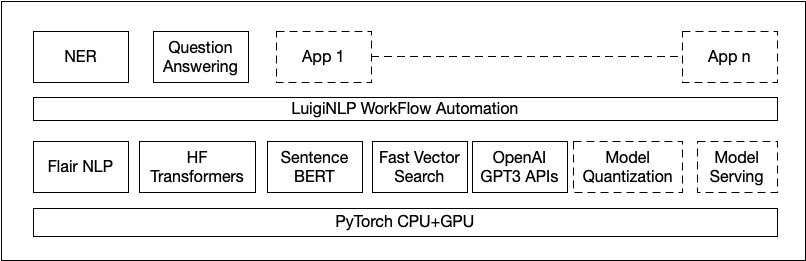

# sprint-1

Basic NLP dev container

1. Create the Dockerfile to generate the container that roughly contains the components above
2. Build the docker image and push it to Docker Hub
3. Pull image from Docker Hub and use

#### Notes

- add a data cleaning library 
https://pypi.org/project/nlp-text-cleaner/
